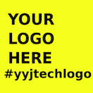

# YYJ Tech Logo Challenge

F.A.Q. about the logo challenge can be found here. 


## About

YYJ Tech is a community of professionals, hackers, designers, students and anyone interested in technology in Victoria, British Columbia (Canada). Please read the Code of [Conduct](https://github.com/yyjtech/code-of-conduct) and feel free to join the [Slack Channel](https://joinyyjtechslack.herokuapp.com/).


## Why?

The previous logo (despite it being cute) wasn't ours 😢. We decided to hold a challenge for our new YYJ Tech Logo. 

## Guidelines

#### From Slack 

> Your team icon is a way for you to visually identify the team. It is used in the desktop and mobile apps, and on your team site. It’s most helpful when you’re on multiple Slack teams.

```
Some tips on choosing a good icon:

- Use a solid background color.
- Use a graphical logo or image rather than text.
- Leave some space around your icon.
- Upload an image that is 132px square or larger.
```

#### From YYJ Tech

```
- Must be original.
- Whales?
- Represent YYJ Tech Community.
```

## Important Dates

**August 18th 2017**: The deadline for submissions.

**August 25th 2017**: The deadline for voting.

## Submissions

Submissions will be accepted from August 4th at 2pm until August 18th at 11:59pm. 

To have your submission counted please title it `name - Official Submission` and replace `name` with your name. AND SUBMIT IT to #yyjtechlogo or DM FlyteWizard (A.K.A. Dominique). Submissions must be in either `.png`, `.ai`, or `.svg`

You can view all logos in the #yyjtechlogo channel. 

A google drive folder will be posted here shortly of all the official submissions. 

## Voting

Voting will be from August 19th at 9am PT until August 25th 5pm PT. 

The link to vote will be available here and in #yyjtechlogo and #general channel in YYJ Tech Slack Team.
